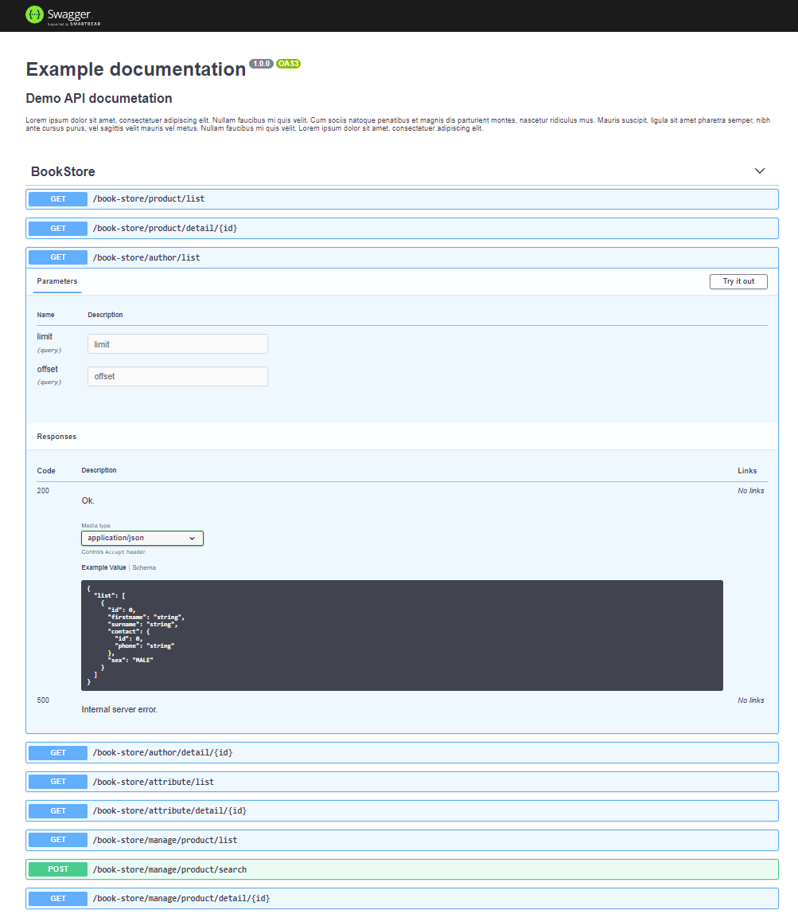

Schemator
=========
- Data validation
- Data sanitization
- JSON Schema builder
- OpenApi builder
- Swagger builder

Data validation
---------------

Define schema:
```php
$schema = new Schema();
$schema->prop('firstname')->string()->minLength(1)->maxLength(100)->required();
$schema->prop('surname')->string()->minLength(1)->maxLength(100)->required();
$schema->prop('sex')->enum(['MALE', 'FEMALE'])->required();

// OR

#[RequiredAll]
class Author
{
    public function __construct(
        #[RangeLength(1, 100)] public string $firstname,
        #[RangeLength(1, 100)] public string $surname,
        #[Enum(['MALE', 'FEMALE'])] public string $sex,
    ) {
    }
}
```

Data validation:
```php
$payload = [
    'firstname' => 'Dave',
    'surname' => 'Lister',
    'sex' => 'MALE',
];

try {
    (new ArrayValidator())->validate($schema, $payload);
    // OR
    (new ArrayValidator())->validate((new SchemaBuilder())->build(Author::class), $payload);
} catch (ValidationFailedException $e) {
    var_dump(MessageFormatter::formatErrors($e->getErrors()));
}
```

Data sanitization
-----------------

```php
$payload = [
    'firstname' => '  Dave  ',
    'surname' => 'Lister ',
];

$sanitizer = new ArrayDataSanitizer();
$sanitizer->props('firstname', 'surname')->trim();
$sanitizer->props('sex')->defaultIfNotExists('MALE');

$sanitizedPayload = $sanitizer->sanitize($payload);
```

JSON Schema builder
---------------------

```php
$builder = new JsonSchemaBuilder();
$builder->buildToJson($schema); // return JSON Schema specification
```

OpenApi builder
-----------------

```php
$api = new Api();
$api->info()->title('Example documentation');
$api->info()->description((string) file_get_contents(__DIR__ . '/description.md'));
$api->info()->version('1.0.0');

Partition::apply($api, Partition::create(static function (Api $api): void {
    $ep = $api->get('/book-store/manage/attribute/list');
    $ep->tags('BookStore', 'BookStore - Manage');
    $ep->headerParam('x-api-key', true)->description('User api key');
    $ep->queryParam('limit');
    $ep->queryParam('offset');
    $ep->jsonResponse200Ok(Attributes::class);
    $ep->jsonResponse401AuthorizationRequired(Problem::class);
    $ep->response500InternalServerError();
}));

$builder = new OpenApiBuilder(new JsonSchemaBuilder());
$generator->build($api); // return OpenApi specification
```

Swagger builder
---------------

```php
$swagger = new SwaggerBuilder();
echo $swagger->build($api, 'Bookstore API'); // return HTML Swagger documentation
```


